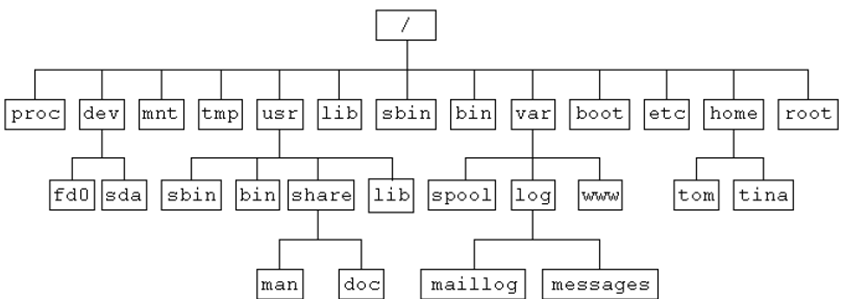
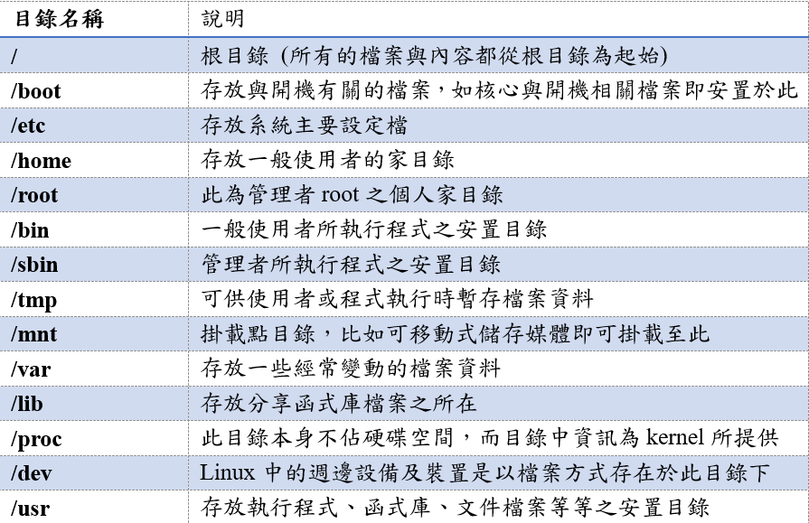
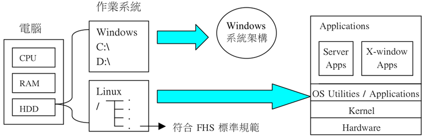

### **第一章：認識 Linux 系統**
*   **系統資訊查詢：**
    *   `ls_release -a`：查看發行版詳細資訊。
    *   `hostnamectl`：查看主機名稱與系統相關資訊。

*   **linux目錄結構**

### **第二章：系統基本操作**
#### 一、 指令下達基本語法
在 Linux 中，指令的基本結構為：**`command [options] [arguments]`**。
*   **Command：** 指令名稱。
*   **Options：** 選項（如 `-a` 或 `--help`），用來調整指令行為。
*   **Arguments：** 參數，指令作用的對象（如檔案或目錄名稱）。

#### 二、 系統入門與輔助按鍵
*   **常用按鍵：**
    *   **Tab：** 指令或檔案名稱補全。
    *   **Ctrl + C：** 中斷目前正在前景執行的程式。
    *   **Ctrl + D：** 中斷 Shell 互動模式或登出。
    *   **↑ ↓：** 切換已使用過的指令歷史。
*   **求助與結束：**
    *   **man：** 查看指令的詳細使用手冊（如 `man cat`）。
    *   **exit / logout：** 登出系統。
    *   **shutdown now / init 0：** 立即關機。
    *   **reboot / init 6：** 重新開機。

*   **網路與套件管理：**
    *   `get`：由 DOS 透過 SSH 下載檔案。
    *   `sudo apt update / upgrade`：更新套件清單。
    *   `sudo apt install arp-scan`：安裝 ARP 掃描工具。
    *   `sudo arp-scan 192.168.58.0/24`：掃描區域網路 IP 衝突情況。
*   **使用者初階操作：**
    *   `sudo useradd -m -s /bin/bash tony`：新增使用者並指定家目錄與 Shell。
    *   `sudo passwd tony`：設定使用者密碼。
*   **說明文件與系統控制：**
    *   `man [指令]`：查看指令使用手冊（如 `man cat`）。
    *   `exit` / `logout`：登出系統。
    *   `init 0` / `shutdown now` / `halt`：關機。
    *   `init 6` / `reboot`：重新開機。

### **第三章：基本指令及資料流重導向**
*   **目錄與路徑：**
    *   `pwd`：顯示目前工作目錄。
    *   `cd`：變換目錄（如 `cd ~` 回家目錄，`cd ..` 回上一層）。
    *   `mkdir`：建立新目錄（`-p` 遞迴建立，`-m` 指定權限）。
    *   `rmdir`：刪除空目錄。
*   **檔案檢視與操作：**
    *   `ls`：檢視檔案清單（`-a` 隱藏檔，`-l` 詳細資料，`-h` 易讀格式）。
    *   `cat`：瀏覽檔案內容（`-b` 標示非空白行號，`-n` 標示所有行號）。
    *   `nl`：印出檔案內容並標示行號。
    *   `tac`：反向列印檔案內容。
    *   `touch`：建立空檔案或更新時間戳記。
    *   `rm`：刪除檔案或目錄（`-i` 提示確認，`-rf` 強制遞迴刪除）。
    *   `cp`：複製檔案或目錄（`-a` 保留所有屬性，`-r` 複製目錄）。
    *   `mv`：移動或重新命名檔案。`-i` 提示確認，`-f` 強制覆蓋）。
*   **輸出與環境設定：**
    *   `echo`：標準輸出字串（`-n` 取消換行）。
    *   `alias`：設定指令別名。
    *   `source`：在當前環境執行設定檔（如 `source .bashrc`）。
    *   `set -o noclobber`：避免重導向覆蓋現有檔案。
*   **資料流重導向與管線：**
    *   `>` / `>>`：標準輸出覆蓋/附加至檔案。
    *   `2>` / `2>>`：標準錯誤輸出覆蓋/附加至檔案。
    *   `<` / `<<`：標準輸入/結束字串輸入。
    *   `|`：管線符號，將前一指令輸出傳給後一指令。
    *   `tee`：同時輸出至螢幕與檔案。
    *   `xargs`：從標準輸入讀取參數並執行指令。
*   **過濾器與文字處理：**
    *   `grep`：搜尋特定字串（`-n` 行號，`-c` 統計次數，`-E` 支援擴充正規表示式）。
    *   `head` / `tail`：檢視檔案的前幾行或後幾行。
    *   `dos2unix`：將 Windows 格式檔案轉為 Linux 格式。
    *   **編輯器：** `vi` / `vim`、`nano`。
*   **輔助與其他：**
    *   `smbclient`：存取 Samba 共享資源。
    *   `expand`：將 Tab 轉為空白。
    *   `nohup`：讓指令在背景持續執行不受登出影響。
    *   `split`：切割大檔案。

### **第四章：帳號管理及權限**
*   **身分切換與授權：**
    *   `su -` / `su`：切換使用者身分。
    *   `sudo`：以其他身分（通常是 root）執行指令。
*   **帳號與群組管理：**
    *   `useradd`：新增帳號（`-G` 加入次要群組，`-s` 指定 Shell）。
    *   `usermod`：修改帳號資訊（`-m -d` 搬移家目錄）。
    *   `userdel -r`：刪除帳號及家目錄。
    *   `groupadd` / `groupmod` / `groupdel`：群組的新增、修改與刪除。
    *   `id` / `groups`：查詢使用者與群組資訊。
    *   `passwd`：變更密碼（`-l` 鎖定，`-u` 解鎖）。
    *   `sudo chpasswd`：大量修改使用者密碼。
*   **權限變更：**
    *   `chmod`：變更權限（支援符號模式如 `u+x` 或數字模式如 `755`）。
    *   `chown`：變更檔案擁有者與群組。
    *   `chgrp`：變更檔案擁有群組。
    *   `setfacl` / `getfacl`：設定與查看存取控制列表 (ACL)。
*   **Python 環境與打包 (補充)：**
    *   `pip install pyinstaller`：安裝打包工具。
    *   `virtualenv` / `deactivate`：建立與離開虛擬環境。
    *   `pyinstaller -F`：將程式打包成單一執行檔。

### **第五章：檔案系統**
*   **磁碟檢查：**
    *   `df -Th`：檢查磁碟空間使用現況與檔案系統類型。
    *   `blkid`：顯示裝置的 UUID 與檔案系統類型。
*   **磁碟管理：**
    *   `fdisk -l`：列出磁碟分割表。
    *   `fdisk [裝置]`：進行磁碟分割。
    *   `partprobe`：強制系統重新讀取分割表。
    *   `mkfs.ext4`：格式化分割區為 ext4 檔案系統。
    *   `mount`：掛載檔案系統（`-a` 掛載 `/etc/fstab` 中所有設定）。
    *   `umount`：解除掛載。

### **第六章：Samba 服務**
*   **服務安裝與控制：**
    *   `sudo apt install samba smbclient cifs-utils`：安裝 Samba 相關套件。
    *   `sudo systemctl restart/status/enable smbd`：管理 Samba 服務。
*   **帳號管理：**
    *   `pdbedit -a`：新增 Samba 使用者。
    *   `pdbedit -L`：列出 Samba 使用者清單。
*   **掛載與排程：**
    *   `mount -t cifs`：掛載 Windows 或 Samba 共享目錄。
    *   `crontab -e`：設定週期性排程任務（如開機自動掛載）。

### **第八章：其它工具**
*   **備份與壓縮：**
    *   `tar`：打包與壓縮（`-zcvf` gzip 壓縮，`-jcvf` bzip2 壓縮，`-zxvf` 解壓縮）。
*   **系統狀態監視：**
    *   `uname -a`：取得系統核心資訊。
    *   `uptime`：顯示系統運行時間與負載。
    *   `who` / `w`：顯示目前登入的使用者資訊。
    *   `top`：動態監視系統資源與程序。
    *   `ps aux`：觀察系統所有程序。
    *   `kill -9 [PID]`：強制中止特定程序。

### **第九章：Shell Scripts**
*   **腳本輔助指令：**
    *   `test`：測試檔案屬性或進行數值/字串比較。
    *   `read`：讀取使用者輸入。
    *   `env`：列印環境變數。
    *   `seq`：產生序列數字。
    *   `date`：顯示日期與時間（可自訂格式如 `+%Y-%m-%d`）。
    *   `select-editor`：重新選擇系統預設編輯器。

### **第十章：程序管理**
*   **觀察與控制：**
    *   `ps -aux` / `ps -lA` / `ps axjf`：多種方式觀察系統程序與程序樹。
    *   `kill`：發送訊號給程序（`-2` 中斷，`-9` 強制停止，`-15` 正常結束）。

### **第十一章：MySQL 8.0 資料庫**
*   **安裝與管理：**
    *   `apt search mysql-server`：搜尋資料庫套件。
    *   `sudo mysql_secure_installation`：進行安全性設定。
    *   `systemctl restart mysql`：重啟資料庫服務。
    *   `sudo mysql -u root -p`：登入 MySQL 管理介面。
    *   `sudo ss -tlnp | grep mysql`：查看 MySQL 監聽的連接埠。
    *   `mysql -h [IP] -P 3306 -u root -p`：遠端登入資料庫。
*   **資料庫備份與還原：**
    *   `mysql -u root -p class < students.sql`：匯入 SQL 資料檔案。