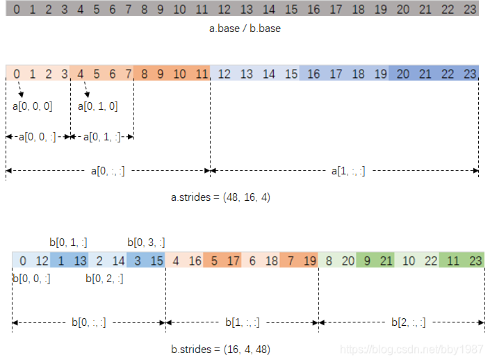

# NumPy reshape 與 transpose 說明

## 1. 核心差異

- reshape：改變陣列形狀，不改變線性元素順序（預設 C-order）。
- transpose：交換軸順序，改變索引座標對應。

一句話記憶：

- reshape 是換外形
- transpose 是換軸向

---

## 2. 範例資料

A 的形狀是 (2,3,4)

A[0] =

```text
[
  [ 0,  1,  2,  3],
  [ 4,  5,  6,  7],
  [ 8,  9, 10, 11]
]
```

A[1] =

```text
[
  [12, 13, 14, 15],
  [16, 17, 18, 19],
  [20, 21, 22, 23]
]
```

---

## 3. transpose 結果

定義：

```python
B = A.transpose(2, 1, 0)
```

- A 軸順序：(0,1,2)
- B 軸順序：(2,1,0)
- B 形狀：(4,3,2)

索引關係：

$$
B[i,j,k] = A[k,j,i]

$$

B 的完整內容：

```python
array([
    [[ 0, 12],
     [ 4, 16],
     [ 8, 20]],

    [[ 1, 13],
     [ 5, 17],
     [ 9, 21]],

    [[ 2, 14],
     [ 6, 18],
     [10, 22]],

    [[ 3, 15],
     [ 7, 19],
     [11, 23]]
])
```

---

## 4. 常見切片解讀

B[0]

- 代表第 0 個第一軸切片
- 形狀是 (3,2)

```python
[[ 0, 12],
 [ 4, 16],
 [ 8, 20]]
```

B[:,0,:]

- 固定中間軸 j=0
- 形狀是 (4,2)

```python
[[ 0, 12],
 [ 1, 13],
 [ 2, 14],
 [ 3, 15]]
```

B[:,:,0]

- 固定最後一軸 k=0
- 形狀是 (4,3)

```python
[[ 0,  4,  8],
 [ 1,  5,  9],
 [ 2,  6, 10],
 [ 3,  7, 11]]
```

B[:,:,1]

- 固定最後一軸 k=1
- 形狀是 (4,3)

```python
[[12, 16, 20],
 [13, 17, 21],
 [14, 18, 22],
 [15, 19, 23]]
```

---

## 5. reshape 對照

- reshape 只改外形，元素總數必須不變。
- 若把同一批元素 reshape 成其他形狀，元素線性順序仍維持 0 到 23。
- transpose 則是透過換軸，改變元素在多維座標中的對應位置。

---

## 6. 總結

- reshape：同順序，不同形狀。
- transpose：同資料，不同軸語意。


## 另一例子


```Python
import numpy as np

a = np.arange(24).reshape([2,3,4])
print(a.base) # =>
# 0 1 2 2 3 4 5 6 7 8 9 16 11 12 13 14 15 16 17 18 19 20 21 22 23
print(a.shape) #==>(2,3, 4)
print(a.strides) #==> (48, 16, 4)
print(a)#===>
#[[[0 1 2 3]
#  [4 5 6 7]
#  [8 9 10 11]]

# [[12 13 14 15]
#  [16 17 18 19]
#  [20 21 22 23]]]

b = a.transpose([1, 2, 0])
print(b.shape) # ==>(3, 4, 2)
print(b.strides) # ==> (16, 4, 48)
print(b)#===>
# [[[ 0 12]
# [ 1 13]
# [ 2 14]
# [ 3 15]]

# [[ 4 16]
# [ 5 17]
# [ 6 18]
# [ 7 19]]

# [[ 8 20]
# [ 9 21]
# [10 22]
# [11 23]]]
```

[transpose圖解](https://i-blog.csdnimg.cn/blog_migrate/0bd288fec2841defe9cd22c74e49321b.png#pic_center)


